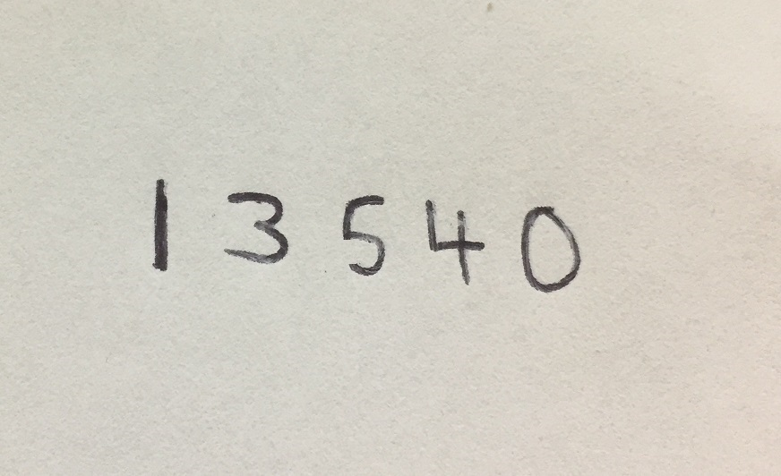
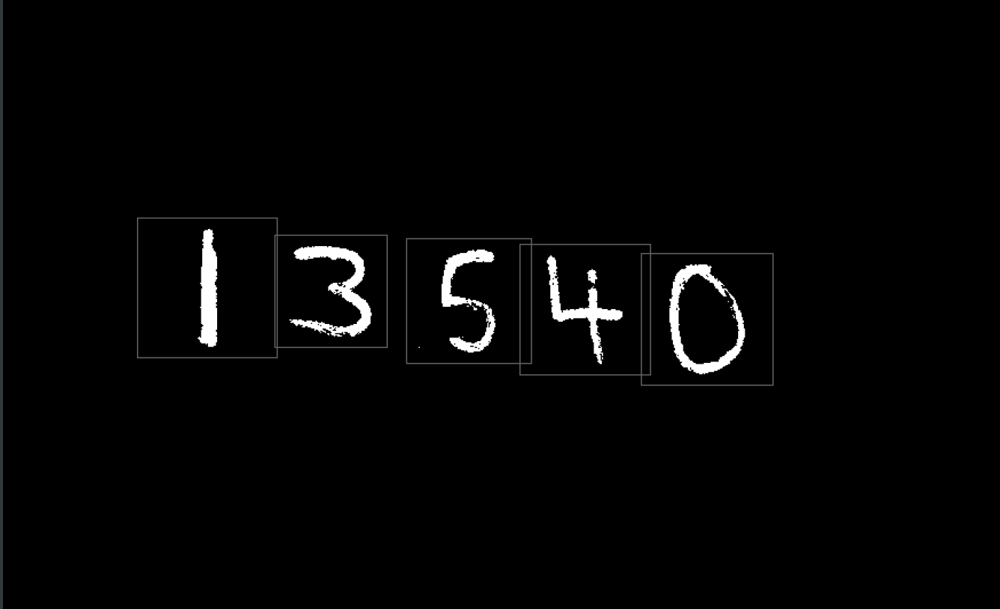
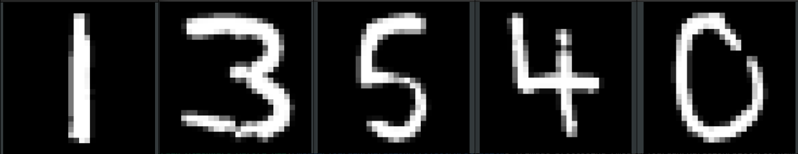
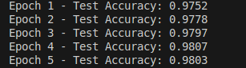

# Neural Network C++ Project

This project implements a neural network using C++ with support for OpenCV and Eigen libraries. It includes a range of features such as image processing and neural network testing. The project processes images and performs multi-layer operations for tasks such as MNIST digit recognition.

## Features
- Multi-layer neural network
- Image processing using OpenCV
- Integration with Eigen for matrix operations
- Support for training and testing phases

.png)