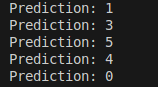

# Neural Network C++ Project

This project implements a neural network using C++ with support for OpenCV and Eigen libraries. It includes a range of features such as image processing and neural network testing. The project processes images and performs multi-layer operations for tasks such as MNIST digit recognition.

## Features
- Multi-layer neural network
- Image processing using OpenCV
- Integration with Eigen for matrix operations
- Support for training and testing phases

## Project Structure

- `src/`: Contains the source code files for the neural network implementation.
- `include/`: Header files for the network layers, matrix operations, and helper functions.
- `dataset/`: Directory for the MNIST dataset and any other image data used in the project.
- `pictures/`: Contains visualizations of the network's results, including output images and performance metrics.

- **Numbers Demonstration**: Shows a collection of images to be used as predictions of the network.
  
  

- **Boxed Numbers**: Displays processed images where the detected digits are enclosed in boxes. This shows the neural network's capability of segmenting and identifying digit regions in images.
  
  

- **Final Results**: Provides a snapshot of the image processing to achieve 28x28 pixel images, similar to MNIST.
  
  

- **Accuracy**: Shows the accuracy of the model during the testing phase.
  
  

- **Confusion Matrix**: Displays the confusion matrix, where each row represents the true label and each column represents the predicted label. This matrix helps in understanding the model's performance by visualizing the number of correct and incorrect predictions for each digit. Both rows and columns starts from 0 to 9

  

- **Model Prediction**: Shows the prediction of the neural network